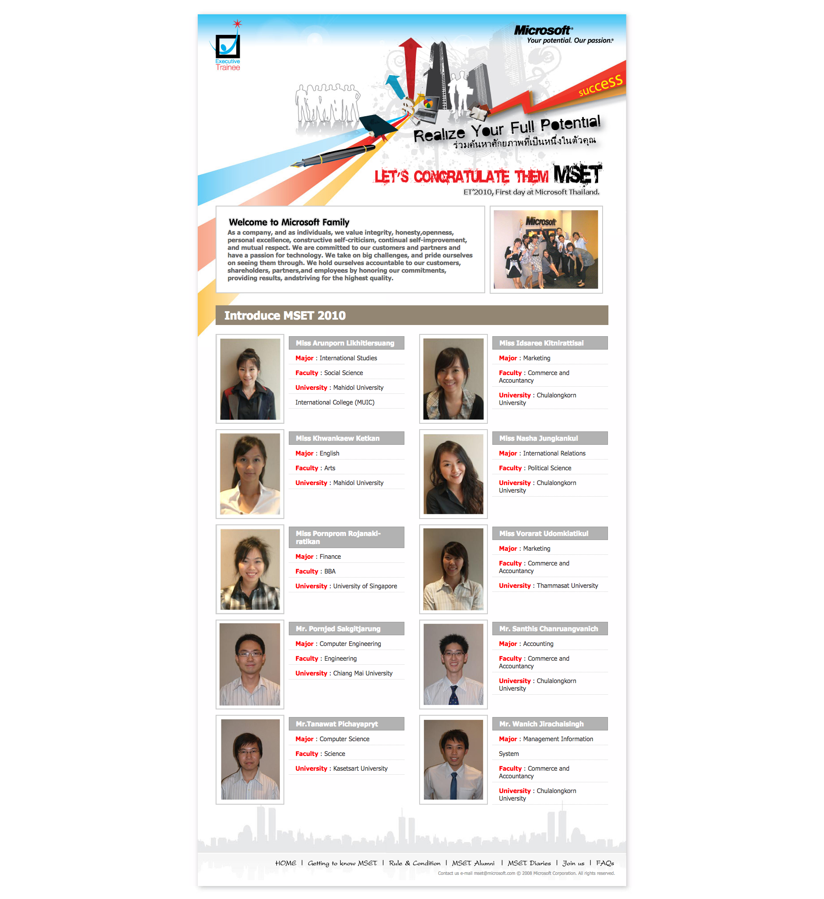

Microsoft Executive Trainee 2009 is Microsoft (Thailand) Ms.Patama Chantaruck initiative to groom fresh graduate from Thailand University to gain world class working experience with Microsoft Thailand.
With 10 out of 4,000 candidates, I was working with Technology Specialist team to not only focus on Microsoft tech but also offer enterprise customers business solution through out Microsoft technologies.

<!--- reference links --->
