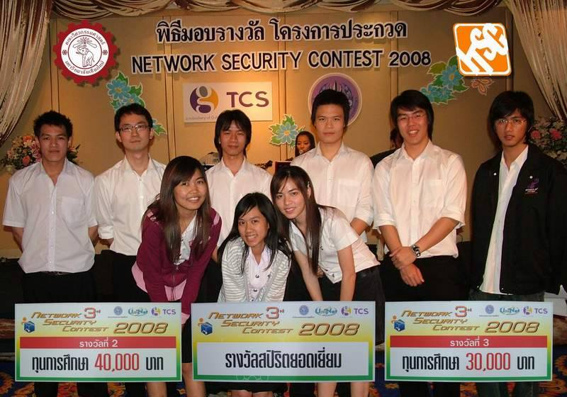

Network security contest is an annual Thailand countrywide contest on network security area establish by Office of the higher education commission and The Communication Solution Co., Ltd
to create challenge in real world network security.

My team won 1st runner up in this contest on 2008 along with others 2 Chiang Mai University Team.  

